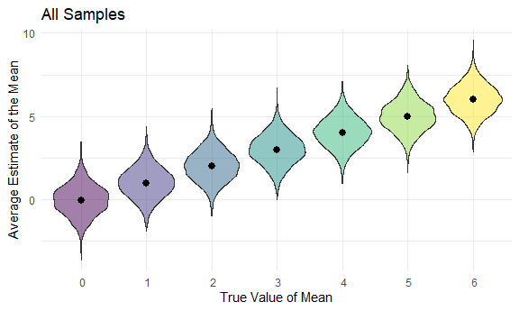

Homework 5
================
Salah El-Sadek (sne2114)

## Problem 1

``` r
homicide_data = read_csv("./homicide-data.csv")
```

    ## 
    ## -- Column specification --------------------------------------------------------
    ## cols(
    ##   uid = col_character(),
    ##   reported_date = col_double(),
    ##   victim_last = col_character(),
    ##   victim_first = col_character(),
    ##   victim_race = col_character(),
    ##   victim_age = col_character(),
    ##   victim_sex = col_character(),
    ##   city = col_character(),
    ##   state = col_character(),
    ##   lat = col_double(),
    ##   lon = col_double(),
    ##   disposition = col_character()
    ## )

This is data on over 50,000 homicides across 50 large cities in the U.S.
collected by the Washington Post. There are 52179 rows and 12 columns
overall.  
Variables in the data include: ***uid, reported\_date, victim\_last,
victim\_first, victim\_race, victim\_age, victim\_sex, city, state, lat,
lon, disposition***

Next, we create a city\_state variable using data on city and state.

``` r
homicide_df = 
  homicide_data %>% 
  mutate(
    city_state = str_c(city, state, sep = "_"),
    resolved = case_when(
      disposition == "Closed without arrest" ~ "unsolved",
      disposition == "Open/No arrest"        ~ "unsolved",
      disposition == "Closed by arrest"      ~ "solved",
    )
  ) %>% 
  select(city_state, resolved) %>% 
  filter(city_state != "Tulsa_AL")

homicide_df
```

    ## # A tibble: 52,178 x 2
    ##    city_state     resolved
    ##    <chr>          <chr>   
    ##  1 Albuquerque_NM unsolved
    ##  2 Albuquerque_NM solved  
    ##  3 Albuquerque_NM unsolved
    ##  4 Albuquerque_NM solved  
    ##  5 Albuquerque_NM unsolved
    ##  6 Albuquerque_NM unsolved
    ##  7 Albuquerque_NM solved  
    ##  8 Albuquerque_NM solved  
    ##  9 Albuquerque_NM unsolved
    ## 10 Albuquerque_NM unsolved
    ## # ... with 52,168 more rows

Here we obtain the total number of homicides and total number of
unsolved homicides (no arrest made).

``` r
aggregate_df = 
  homicide_df %>% 
  group_by(city_state) %>% 
  summarize(
    hom_total = n(),
    hom_unsolved = sum(resolved == "unsolved")
  )
```

    ## `summarise()` ungrouping output (override with `.groups` argument)

``` r
aggregate_df
```

    ## # A tibble: 50 x 3
    ##    city_state     hom_total hom_unsolved
    ##    <chr>              <int>        <int>
    ##  1 Albuquerque_NM       378          146
    ##  2 Atlanta_GA           973          373
    ##  3 Baltimore_MD        2827         1825
    ##  4 Baton Rouge_LA       424          196
    ##  5 Birmingham_AL        800          347
    ##  6 Boston_MA            614          310
    ##  7 Buffalo_NY           521          319
    ##  8 Charlotte_NC         687          206
    ##  9 Chicago_IL          5535         4073
    ## 10 Cincinnati_OH        694          309
    ## # ... with 40 more rows

Using prop.test to estimate proportion of homicides that went unsolved
in Baltimore, MD.

``` r
prop.test(
  aggregate_df %>% filter(city_state == "Baltimore_MD") %>% pull(hom_unsolved), 
  aggregate_df %>% filter(city_state == "Baltimore_MD") %>% pull(hom_total)) %>% 
  broom::tidy() %>% 
  select(estimate, conf.low, conf.high)
```

    ## # A tibble: 1 x 3
    ##   estimate conf.low conf.high
    ##      <dbl>    <dbl>     <dbl>
    ## 1    0.646    0.628     0.663

Iterating the prop.test for all cities.

``` r
results_df = 
  aggregate_df %>% 
  mutate(
    prop_tests = map2(.x = hom_unsolved, .y = hom_total, ~prop.test(x = .x, n = .y)),
    tidy_tests = map(.x = prop_tests, ~broom::tidy(.x))
  ) %>% 
  select(-prop_tests) %>% 
  unnest(tidy_tests) %>% 
  select(city_state, estimate, conf.low, conf.high)

results_df
```

    ## # A tibble: 50 x 4
    ##    city_state     estimate conf.low conf.high
    ##    <chr>             <dbl>    <dbl>     <dbl>
    ##  1 Albuquerque_NM    0.386    0.337     0.438
    ##  2 Atlanta_GA        0.383    0.353     0.415
    ##  3 Baltimore_MD      0.646    0.628     0.663
    ##  4 Baton Rouge_LA    0.462    0.414     0.511
    ##  5 Birmingham_AL     0.434    0.399     0.469
    ##  6 Boston_MA         0.505    0.465     0.545
    ##  7 Buffalo_NY        0.612    0.569     0.654
    ##  8 Charlotte_NC      0.300    0.266     0.336
    ##  9 Chicago_IL        0.736    0.724     0.747
    ## 10 Cincinnati_OH     0.445    0.408     0.483
    ## # ... with 40 more rows

Plotting the proportion of unsolved homicides with error bars for each
city.

``` r
results_df %>% 
  mutate(city_state = fct_reorder(city_state, estimate)) %>% 
  ggplot(aes(x = city_state, y = estimate)) +
  geom_point() + 
  geom_errorbar(aes(ymin = conf.low, ymax = conf.high)) + 
  theme(axis.text.x = element_text(angle = 90, vjust = 0.5, hjust = 1))
```


## Problem 2

Loading the data and merging each spreadsheet into a list while
preserving the file names containing ID and study group status.

``` r
study_df = 
  tibble(
    path = list.files("data")) %>% 
  mutate(
    path = str_c("data/", path),
    data = map(path, read_csv)
    ) %>%
  unnest(data) %>%
  mutate(path = str_replace(path, "data/", " "),
         path = str_replace(path, ".csv", " ")) %>%
  separate(path, into = c("group", "subjectID"), sep = "_") 
```

    ## 
    ## -- Column specification --------------------------------------------------------
    ## cols(
    ##   week_1 = col_double(),
    ##   week_2 = col_double(),
    ##   week_3 = col_double(),
    ##   week_4 = col_double(),
    ##   week_5 = col_double(),
    ##   week_6 = col_double(),
    ##   week_7 = col_double(),
    ##   week_8 = col_double()
    ## )
    ## 
    ## 
    ## -- Column specification --------------------------------------------------------
    ## cols(
    ##   week_1 = col_double(),
    ##   week_2 = col_double(),
    ##   week_3 = col_double(),
    ##   week_4 = col_double(),
    ##   week_5 = col_double(),
    ##   week_6 = col_double(),
    ##   week_7 = col_double(),
    ##   week_8 = col_double()
    ## )
    ## 
    ## 
    ## -- Column specification --------------------------------------------------------
    ## cols(
    ##   week_1 = col_double(),
    ##   week_2 = col_double(),
    ##   week_3 = col_double(),
    ##   week_4 = col_double(),
    ##   week_5 = col_double(),
    ##   week_6 = col_double(),
    ##   week_7 = col_double(),
    ##   week_8 = col_double()
    ## )
    ## 
    ## 
    ## -- Column specification --------------------------------------------------------
    ## cols(
    ##   week_1 = col_double(),
    ##   week_2 = col_double(),
    ##   week_3 = col_double(),
    ##   week_4 = col_double(),
    ##   week_5 = col_double(),
    ##   week_6 = col_double(),
    ##   week_7 = col_double(),
    ##   week_8 = col_double()
    ## )
    ## 
    ## 
    ## -- Column specification --------------------------------------------------------
    ## cols(
    ##   week_1 = col_double(),
    ##   week_2 = col_double(),
    ##   week_3 = col_double(),
    ##   week_4 = col_double(),
    ##   week_5 = col_double(),
    ##   week_6 = col_double(),
    ##   week_7 = col_double(),
    ##   week_8 = col_double()
    ## )
    ## 
    ## 
    ## -- Column specification --------------------------------------------------------
    ## cols(
    ##   week_1 = col_double(),
    ##   week_2 = col_double(),
    ##   week_3 = col_double(),
    ##   week_4 = col_double(),
    ##   week_5 = col_double(),
    ##   week_6 = col_double(),
    ##   week_7 = col_double(),
    ##   week_8 = col_double()
    ## )
    ## 
    ## 
    ## -- Column specification --------------------------------------------------------
    ## cols(
    ##   week_1 = col_double(),
    ##   week_2 = col_double(),
    ##   week_3 = col_double(),
    ##   week_4 = col_double(),
    ##   week_5 = col_double(),
    ##   week_6 = col_double(),
    ##   week_7 = col_double(),
    ##   week_8 = col_double()
    ## )
    ## 
    ## 
    ## -- Column specification --------------------------------------------------------
    ## cols(
    ##   week_1 = col_double(),
    ##   week_2 = col_double(),
    ##   week_3 = col_double(),
    ##   week_4 = col_double(),
    ##   week_5 = col_double(),
    ##   week_6 = col_double(),
    ##   week_7 = col_double(),
    ##   week_8 = col_double()
    ## )
    ## 
    ## 
    ## -- Column specification --------------------------------------------------------
    ## cols(
    ##   week_1 = col_double(),
    ##   week_2 = col_double(),
    ##   week_3 = col_double(),
    ##   week_4 = col_double(),
    ##   week_5 = col_double(),
    ##   week_6 = col_double(),
    ##   week_7 = col_double(),
    ##   week_8 = col_double()
    ## )
    ## 
    ## 
    ## -- Column specification --------------------------------------------------------
    ## cols(
    ##   week_1 = col_double(),
    ##   week_2 = col_double(),
    ##   week_3 = col_double(),
    ##   week_4 = col_double(),
    ##   week_5 = col_double(),
    ##   week_6 = col_double(),
    ##   week_7 = col_double(),
    ##   week_8 = col_double()
    ## )
    ## 
    ## 
    ## -- Column specification --------------------------------------------------------
    ## cols(
    ##   week_1 = col_double(),
    ##   week_2 = col_double(),
    ##   week_3 = col_double(),
    ##   week_4 = col_double(),
    ##   week_5 = col_double(),
    ##   week_6 = col_double(),
    ##   week_7 = col_double(),
    ##   week_8 = col_double()
    ## )
    ## 
    ## 
    ## -- Column specification --------------------------------------------------------
    ## cols(
    ##   week_1 = col_double(),
    ##   week_2 = col_double(),
    ##   week_3 = col_double(),
    ##   week_4 = col_double(),
    ##   week_5 = col_double(),
    ##   week_6 = col_double(),
    ##   week_7 = col_double(),
    ##   week_8 = col_double()
    ## )
    ## 
    ## 
    ## -- Column specification --------------------------------------------------------
    ## cols(
    ##   week_1 = col_double(),
    ##   week_2 = col_double(),
    ##   week_3 = col_double(),
    ##   week_4 = col_double(),
    ##   week_5 = col_double(),
    ##   week_6 = col_double(),
    ##   week_7 = col_double(),
    ##   week_8 = col_double()
    ## )
    ## 
    ## 
    ## -- Column specification --------------------------------------------------------
    ## cols(
    ##   week_1 = col_double(),
    ##   week_2 = col_double(),
    ##   week_3 = col_double(),
    ##   week_4 = col_double(),
    ##   week_5 = col_double(),
    ##   week_6 = col_double(),
    ##   week_7 = col_double(),
    ##   week_8 = col_double()
    ## )
    ## 
    ## 
    ## -- Column specification --------------------------------------------------------
    ## cols(
    ##   week_1 = col_double(),
    ##   week_2 = col_double(),
    ##   week_3 = col_double(),
    ##   week_4 = col_double(),
    ##   week_5 = col_double(),
    ##   week_6 = col_double(),
    ##   week_7 = col_double(),
    ##   week_8 = col_double()
    ## )
    ## 
    ## 
    ## -- Column specification --------------------------------------------------------
    ## cols(
    ##   week_1 = col_double(),
    ##   week_2 = col_double(),
    ##   week_3 = col_double(),
    ##   week_4 = col_double(),
    ##   week_5 = col_double(),
    ##   week_6 = col_double(),
    ##   week_7 = col_double(),
    ##   week_8 = col_double()
    ## )
    ## 
    ## 
    ## -- Column specification --------------------------------------------------------
    ## cols(
    ##   week_1 = col_double(),
    ##   week_2 = col_double(),
    ##   week_3 = col_double(),
    ##   week_4 = col_double(),
    ##   week_5 = col_double(),
    ##   week_6 = col_double(),
    ##   week_7 = col_double(),
    ##   week_8 = col_double()
    ## )
    ## 
    ## 
    ## -- Column specification --------------------------------------------------------
    ## cols(
    ##   week_1 = col_double(),
    ##   week_2 = col_double(),
    ##   week_3 = col_double(),
    ##   week_4 = col_double(),
    ##   week_5 = col_double(),
    ##   week_6 = col_double(),
    ##   week_7 = col_double(),
    ##   week_8 = col_double()
    ## )
    ## 
    ## 
    ## -- Column specification --------------------------------------------------------
    ## cols(
    ##   week_1 = col_double(),
    ##   week_2 = col_double(),
    ##   week_3 = col_double(),
    ##   week_4 = col_double(),
    ##   week_5 = col_double(),
    ##   week_6 = col_double(),
    ##   week_7 = col_double(),
    ##   week_8 = col_double()
    ## )
    ## 
    ## 
    ## -- Column specification --------------------------------------------------------
    ## cols(
    ##   week_1 = col_double(),
    ##   week_2 = col_double(),
    ##   week_3 = col_double(),
    ##   week_4 = col_double(),
    ##   week_5 = col_double(),
    ##   week_6 = col_double(),
    ##   week_7 = col_double(),
    ##   week_8 = col_double()
    ## )

Using pivot\_longer so that we can have week number and observations as
separate columns

``` r
study_df =
  study_df %>% 
  pivot_longer(
    week_1:week_8,
    names_to = "Week", 
    names_prefix = "week_", 
    values_to = "Observations"
  ) %>%
  mutate(
    group = str_replace(group, "con", "Control"),
    group = str_replace(group, "exp", "Experimental")
  ) %>%
  relocate(subjectID) %>%
  mutate(
    week = as.numeric(Week)
  )

study_df
```

    ## # A tibble: 160 x 5
    ##    subjectID group      Week  Observations  week
    ##    <chr>     <chr>      <chr>        <dbl> <dbl>
    ##  1 "01 "     " Control" 1             0.2      1
    ##  2 "01 "     " Control" 2            -1.31     2
    ##  3 "01 "     " Control" 3             0.66     3
    ##  4 "01 "     " Control" 4             1.96     4
    ##  5 "01 "     " Control" 5             0.23     5
    ##  6 "01 "     " Control" 6             1.09     6
    ##  7 "01 "     " Control" 7             0.05     7
    ##  8 "01 "     " Control" 8             1.94     8
    ##  9 "02 "     " Control" 1             1.13     1
    ## 10 "02 "     " Control" 2            -0.88     2
    ## # ... with 150 more rows

Spaghetti plot for observations on each subject over time.

``` r
study_df %>% 
  ggplot(aes(x = Week, y = Observations, color = group)) +
  geom_path(aes(group = subjectID)) +
  geom_point() +
  labs(
      title = "Observations for each Subject Over Time",
      x = "Week",
      y = "Observations",
      color = "Group: ")
```


The experimental group has higher values for observations overall
compared to the control group. Also, the values for observations seems
to increase over time for the experimental group compared to the
control.

## Problem 3

Generate a normal distribution with n = 30, mean of 0, and standard
deviation of 5. We will then run a t-test with mu = 0 and rerun to
generate 5000 data sets (along with their estimates and p-value).

``` r
sim_mean_p = function(n = 30, mu, sigma = 5) {
  
  sim_data = 
    tibble(
    x = rnorm(n = n, mean = mu, sd = sigma),
  ) %>%
    t.test() %>%
    broom::tidy()
  
  sim_data %>% 
    select(estimate, p.value)
}

sim_results =
  rerun(5000, sim_mean_p(mu = 0)) %>% 
  bind_rows()

sim_results %>% 
  select(estimate, p.value)
```

    ## # A tibble: 5,000 x 2
    ##    estimate p.value
    ##       <dbl>   <dbl>
    ##  1   0.998    0.253
    ##  2   1.37     0.123
    ##  3  -0.682    0.409
    ##  4  -0.0530   0.944
    ##  5   1.12     0.261
    ##  6   0.606    0.421
    ##  7   0.0201   0.981
    ##  8  -0.361    0.607
    ##  9  -0.149    0.886
    ## 10   1.43     0.103
    ## # ... with 4,990 more rows

We now repeat for mu = 1,2,3,4,5,6.

``` r
multi_means = 
  tibble(multi_mu = c(0, 1, 2, 3, 4, 5, 6)) %>%
  mutate(
    output = map(.x = multi_mu, ~rerun(5000, sim_mean_p(mu = .x))),
    estimate = map(output, bind_rows)) %>% 
  select(-output) %>% 
  unnest()
```

    ## Warning: `cols` is now required when using unnest().
    ## Please use `cols = c(estimate)`

``` r
multi_means
```

    ## # A tibble: 35,000 x 3
    ##    multi_mu estimate p.value
    ##       <dbl>    <dbl>   <dbl>
    ##  1        0   0.411   0.680 
    ##  2        0   0.199   0.830 
    ##  3        0  -1.03    0.174 
    ##  4        0  -0.0481  0.949 
    ##  5        0  -0.317   0.670 
    ##  6        0   0.561   0.493 
    ##  7        0  -1.61    0.0542
    ##  8        0   0.454   0.603 
    ##  9        0  -0.457   0.618 
    ## 10        0   0.861   0.406 
    ## # ... with 34,990 more rows

Plotting the proportion of times a false null hypothesis was rejected
(power) versus effect size. We can see that effect size is positively
correlated with power. We begin reaching the max power of 1 starting
with an effect size of 4.

``` r
multi_means %>%
  filter(p.value < 0.05) %>%
  group_by(multi_mu) %>%
  count() %>%
  mutate(power = n/5000) %>%
  ggplot(aes(x = multi_mu, y = power, color = multi_mu)) +
  geom_point() +
  geom_line() +
  labs(
    title = "Association between Power and Effect Size",
    x = "True Value of Mu",
    y = "Power",
    color = "True Value of Mu: "
  )
```


plot

``` r
all_samples_p = 
  multi_means %>%
   mutate(
    multi_mu = str_c(" ", multi_mu)) %>%
  ggplot(aes(x = multi_mu, y = estimate, fill = multi_mu)) +
  geom_violin(alpha = .5) +
  labs(
    title = "All Samples",
    x = "True Value of Mean",
    y = "Average Estimate of the Mean") +
  theme(legend.position = "none") + 
  stat_summary(fun = "mean")

all_samples_p
```

    ## Warning: Removed 7 rows containing missing values (geom_segment).


